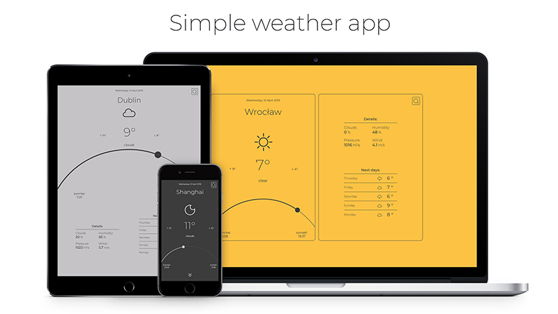
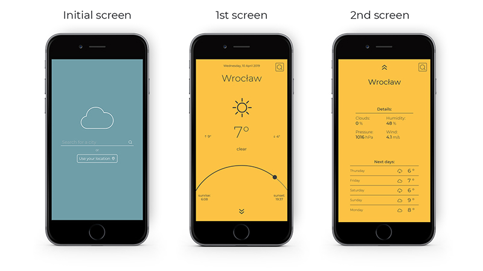

#  Simple weather app
Simple weather app that shows current weather and 5-days forecast for selected city or user's location. It uses [OpenWeatherMap](https://openweathermap.org/) API. It is fully responsive and was coded with mobile-first methodology, using HTML, CSS and JavaScript. 

**[Check out live demo here!](https://maciejkorolik.github.io/WeatherApp/)**

##  Features

**The app has 3 main screens on mobile devices:**
 * Initial screen:
	 * Search bar
	 * Geolocation button
	 * Possible error display
  * 1st screen:
	  * Current date
	  * City name
	  * Icon showing weather condition
	  * Weather condition description
	  * Current temperature and min/max temperatures for the day
	  * Graphics of current position of sun (percent of the day or night)
	  * Sunrise and sunset time
* 2nd screen:
	* City name
	* Current weather details 
	* Forecast for next 5 days

On larger screens the features of the last two are combined into one.

##  Setup

Clone this repo to your desktop and run  `npm install`  to install all the dependencies.
* to build the app -  type  `npm run build`
* to use the Webpack Dev Server - type `npm run start:dev`

  

##  Issues and to-do
**Following issues are still to be fixed:**
* Geolocation not working or working very slowly on facebook/messenger browser
* No errors are shown when geolocation is not supported
* Time is not converted when searching for cities in different timezones

**Plans for future development:**
* typeahead function for searchbar
* list of favourite/most searched cities with use of local storage
* charts of temperature/rain/snow, etc for next days
* Switch for changing units (Celsius/Farenheit)
* Air quality display

  
##  Credits

* Awesome icons by [Zwicon](https://www.zwicon.com/)
* Design by Klaudia Sziller 
* Sun path graphics inspired by [Simple Weather App by Qiner Wang](https://www.behance.net/gallery/65686219/simpe-weather-app?tracking_source=search%257Cweather%2bapp)

  

##  Contact

Created by [Maciej Korolik](https://github.com/maciejkorolik/) - feel free to contact me!